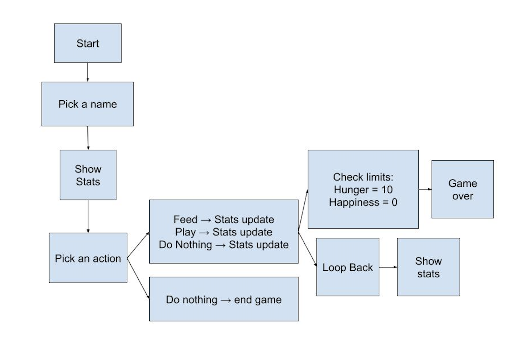

[](https://classroom.github.com/a/EKU0JGMm)
# Pet Rock Simulator  

A fun, text-based game where you adopt and take care of a virtual pet rock.  
Keep your rock fed and happy—or risk losing it in some very silly ways.  

---

## About the Game  
Pet Rock Simulator is a simple Python project that lets you interact with a virtual rock through the command line.  
You’ll manage two stats—**Hunger** and **Happiness**—while making choices each turn. The goal is survival for as long as possible; neglect your pet, and it may leave you behind.  

---

## Features  
- **Custom Rock Naming** – Give your rock any name you like (up to 16 characters).  
- **Stat Tracking** – Two core stats to balance:  
  - Hunger (0–10)  
  - Happiness (0–10)  
- **Player Actions** – Choose one action per turn:  
  - Feed (lowers hunger, slightly raises happiness)  
  - Play (raises happiness but increases hunger)  
  - Do nothing (raises hunger, lowers happiness)  
  - Quit anytime  
- **Game Over Messages** – Different funny endings based on how you treat your rock.  
- **Stat Updates** – Hunger rises and happiness falls automatically every turn.  

---

## Requirements  
- Python 


---
## Overall concept of the game 

##  How to Run  
1. Download or clone this repository.  
2. Open a terminal in the project folder.  
3. Run:  

```bash
python3 pet_rock.py
